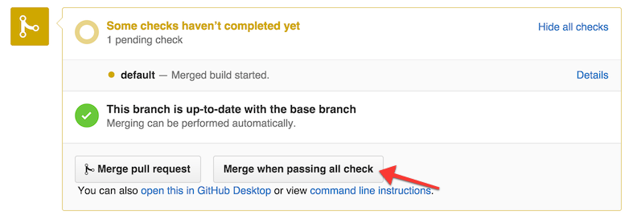

# ReserveMerge
Chrome extension for auto-merge when all checks has passed on github.com.

## Usage

Click "Merge when passing all check" button on Pull request page, and wait without closing window.

## Installation
[Install this extension from the Chrome Web Store](https://chrome.google.com/webstore/detail/reservemerge/glmagehpijnkcpcjlchbiijghmmphpbe).